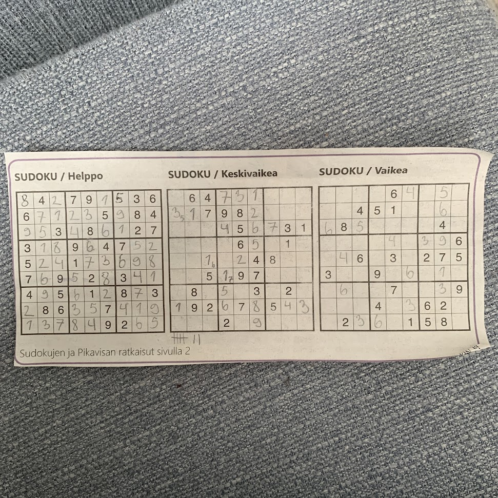

# Master's thesis
Repository for my MSc thesis

`sudo apt install texlive-full`

`latexmk`

# Notes, study plan & diary
Mapping study is a good one in the results. The results are in two parts. The second one is analysis of other sort.

How to make CLAs more transparent and easier to use?

Take all the good bits from esespaper to 1 Introduction

Is redistributing mongodb practically possible under sspl?

Map introduction and methods paragraphs
### What has already been found?
gplv3 might not have been considered as a legal instrument in 2006
### What do you think you'll find as data?
different categories for licenses in software engineering, their average lengths, use of different characters and time between different versions

## 1 Introduction
- setting
- definition
- problem
- easier sub-problem
- thesis' contribution
### 1.1 Research goal, questions, and contributions
- primary object of this research (rqs)
- 1.2 will examine terms
- viewpoints
### 1.2 Background and terminology of public copyright licenses
- state of current terminology
- terms of non-focus areas of thesis
- examples of these terms
- acknowledge some other essential but non-focus
- efforts of terminology standardization
- figure to demonstrate terms
- grammar specifications
- figure from grammar
- define public copyright licenses in se
- the connection in terms figure
- acknowledge the topic is complex
### 1.3 Thesis structure
thesis structure
## 2 Methods
- aim of the chapter
- explain slr
- study follows kitchenham 2007
- how the review process came to be
- reliability & validity
### 2.1 Research questions
- purpose of rqs
- aim of individual rqs
### 2.2 Search strategy
- where was search process conducted in (inclusion/exclusion in appendix a)
- data extraction process
#### 2.2.1 Search method
- more on where was search process conducted in
#### 2.2.2 Search scope and terms
- how were search terms determined
- search string
- how many results
- finalized search string
### 2.3 Search process
- Study selection divided into multiple stages (figure)
- first stage titles, abstracts and keywords
- second stage inclusion exclusion criteria (quality assesment incl/excl, manual excl in appendix b)
- third stage manual review (final list of licenses in appendix c (maybe in hosted javascript githubpages as well))
### 2.4 Inclusion and exclusion criteria
- inclusion criterias
- exclusion criterias
- comments on applying
### 2.5 Quality and evidence criteria
- quality criteria was also taken into consideration
- quality criteria
- quality assesment and figure
### 2.6 Data collection and data analysis
- what was done to answer rq (table data extraction form)
- aim of scope and evidence levels (alves et al)
- categorization of results
- nex chapter presents outcomes
## 3 Results
- information about chapter
- how many licenses and why
- statistical overview with figures
- how many licenses during each stage (figure)
- basic statistic on final licenses (figure)
- essential statistics (figure)
### 3.1 RQ1
- figures and study identifier tables
### 3.2 RQ2
- figures and study identifier tables
### 3.3 RQ3
- figures and study identifier tables
## 4 Discussion
- indications
- follow-up observation
- observation 1
- observation 2
- sum-up from those two
### 4.1 Implications for research
- how to improve scientific scene 1
- how to improve scientific scene 2
- how to improve scientific scene 3
### 4.2 Implications for software engineering professionals
- how to improve professional scene 1
- how to improve professional scene 2
- how to improve professional scene 3
- overall
### 4.3 Limitations and threats to validity
- major limitation
- possible threats to validity
#### 4.3.1 Limitations of license selection for review
- efforts to inclusion
- as with all slr all licenses cannot be reviewed manually
- license selection was done in sufficient manner
#### 4.3.2 Limitation in data extraction
- importance of data extraction
- lack of measurements and tooling
## 5 Conclusions
- primary objective of this study
- conclusions from each rq
### 5.1 Future research
- adopting a clear baseline
- what kind of efforts and why
- what this thesis has provided

## Timing
week 3 plan review

week 4 plan review

week 5 plan review

week 6 supervisor meeting, plan review

week 7 plan review

week 8 conduct review

week 9 conduct review

week 10 conduct review

week 11 conduct review

week 12 conduct review

week 13 conduct review

week 14 conduct review

week 15 conduct review

week 16 document review

week 17 document review

week 18 first draft, wait for comments

week 19 second draft, wait for comments

week 20 send final draft, wait for final comments

week 21 read final comments, student sends final version, supervisor requests review

week 22 wait for review

week 23 wait for review

week 24
mon: supervisor sends to grappa first thing on monday
wed: student submits thesis to E-thesis

## week 7
tue finish 1.0: 

mon finish 1.0 & title1 1.1,-2,-3 paragraphs: rms responded to me saying they'll take a look at the sspl if it actually would be considered free. titled all paragaphs. did not finish 1.0. will do that tomorrow.

## week 6
fri title 1.1, 1.2 and 1.3 paragraphs: did nothing cuz i had to look after the baby at home the whole day.

thu title methods paragraphs: managed to find out a better citation for the freedom definition

wed -: took a break from mental health reasons. finished the sudoku and learned about hidden & naked singles, pairs, triples and quads. im a sudoku god.

tue continue writing 1.0: basically just tried to figure out what's the deal with sspl and is it any good.

mon continue writing 1.0: the morning started pretty good in the 3rd floor with a pomodoro. we'll see how long this drive lasts.

## week 5
fri try to get motivated: no motivation. added thesis diary and study plan to readme. tried to solve sudoku all day. this is how far i got.

thu write 1.0: didn't write jack

wed finish 1.0: continued writing 1.0 but very slowly. idk if i can even do this.

tue write 1.1, finish 1.0: organize chrome tabs

mon write 1.0, send email to supervisor: started writing 1.0. sent email to supervisor.

## week 4
fri 26.1 write introduction 1.0, send email to supervisor: didn't write introduction nor send email to supervisor. had to take baby to nutritional therapist.

thu 25.1 take notes from 3 other slr studies' introductions, write introduction: didn't write introduction. tooks notes from 2 other finnish slr studies introduction 1.0s. will have to find another longer slr on software engineering since the third i found on ieee is too short.

wed 24.1 write introduction: didn't manage to write any introduction. instead found some articles and forum discussions about the rhel gpl violation incident.

tue 23.1 think about research questions: I started taking a model from Nurmivaara's systematic literature review on green software. I now have my first set of 4 research questions.

mon 22.1 think about research questions

## week 3
fri 19.1 read about slr

thu 18.1 fix latex

mon 22.1 read about slr: I read the SLR slideshow through. The title is now multivocal slr on software licenses in software engineering. The research questions are not clear yet. I am scared again.