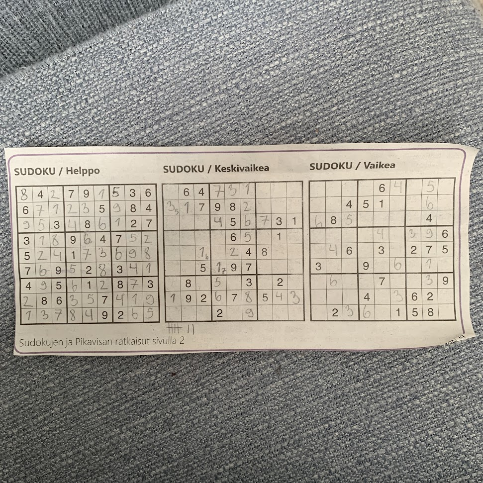

## Diary
### week 27
sat: will keep the license names in figure 3-5 since they provide information of the "other" licenses

### week 26
wed: 1,2 done continuing on 3 answering to RQs. then only discussion and conclusions to finish.

### week 25
tue: finally edited the diagram on floss. it was such a dreadful task to take on but now its pretty accurate i think.

### week 24
tue: ah it seems i stopped writing thesis diary when the methods.py got finished lol. this whole day i wrote Methods and i just gotta remove the red notes i left for myself during the process of methods.py. the fucking foss oss free diagram i made is so cool i makes me kinda sick to see how i really cant use it if i wanna be true to myself.
### week 18
fri: we just need to remove creative commons and gfdl licenses and then we call it a day. regex is hard. never mind it seems to match correctly but why tf does my script write the excluded licenses still to stage2licnses????

tue: ohh sliid we bout to do some ratcliff-obershelp up in this binnich

### week 17
fri: i have a problem. since whitespace is higher order in sort method in python than, say the character 'A', the license of AGPLv3 is wayy lower than the actual license with whitespace inserted on top of it. i do not know what to do. this might be farfetched but can i somehow take a cosine similarity between the license texts. jesus fucking christ what a dumpster fire. maybe ill just try the difflib and hope for the best. hope, that it will remove titles and law-wise unnecessary bits so that i can remove duplicates even somehow. to mitigate the validity threat ill document the removed duplicate shortcodes. surely this way no one is going to be upset.

thu: how do i remove duplicates and mark them as duplicates. maybe ill just mark the duplicates in a text file with new lines and call it a day all on the validity threatness.

wed: i gotta put stage 2 licenses in an .md as well. the last table of licenses can be as appendix in the thesis as well but i also want the licenses of stage 3 to exist in github in LICENSENAME.txt as well. now i will remove duplicates but wth why is there only 621 licenses in duplicate finding. now theres 752 but it should be 754 why?

is it possible that an empty license exists in my full licenses and its not a manual license. lol no it was just that my plan9 manual license was empty instead of a space character.

### week 16
wed: stage 2 having the sources is just too large scope for this thesis. i gotta move on.

tue: i gotta put my stage 1 and 2 into github as markdown tables. do that next.

mon: zero licenses left missing licenses on stage 2. now i gotta include and exclude. i could do it so that inclusion principle is stronger than exclusion principle. i should maybe first include licenses then check the exclusion folder which licenses it contains. then check somewhat - no, nvm scrap that. we do it so that we find and remove duplicates now since thats something we have to do only once anyways its not going to change. inclusion and exclusion is something that we need to do more times than just once. first number then dash then the license name in the duplicate finding. remove empty licenses from that license list. it should be 780 - 26 = 754.

### week 15
sat: 13 licenses left.

fri: 26 licenses left this was actually pretty fast.

thu: 82 licenses left ffs. god give me strength.

mon: edited the script so that it prints out all empty licenses shortcodes so that i can now check which have one-click licenses to manually copy from or not

### week 14
fri: have to go through all empty licenses that actually might have contained a simple one click URL to fetch the license. we incease the scope for this one.

thu: removed the code from stage2-3.py that removes exceptions i.e. duplicates from the licenses. 111 licenses to go.

wed: i continue to copy paste manually licenses from the listing cites which are not found in scancode db. 115 licenses to go.

### week 12 (2025)
tue: i took a break of 4 months from advancing this thesis. now ill have to figure out what was i doing. what should i do next? what needs to be still done? according to my notes stage 1 of literature selection process (2.3) seems to be done. next up stage 2 i guess. it seems like there should be an iteration between with stage 2 and stage 3 but i  might need to somehow make it so that iterations happen only inside one individual stage. i also need to somehow write this diary to latex maybe once im going to be done with 2. Methods. Then I'll write also 1. Introduction anew. Diary in diary.md. Plan in Joplin.

wed: either one is more simpler: removing quasi-duplicates or applying exclusion criteria. stage 2 could be just inclusion and check no good licenses end up in un-included. stage 3 could be remove duplicate licenses from a sorted order and exclude non-software licenses. removing duplicates is a validity threat since thats something this time ill have to do manually by a human.
### week 46
mon: i will resume documenting my journey here on the making of the thesis. once after every pomodoro. so 20 mins or work then 5 mins of documenting what i did. my supervisor suggested me to keep on writing the thesis diary so here i am. removing unnecessary documentation from the code to this diary. font licenses may be considered software licenses. im content with the fact that detecting software-explicit licenses with regex might be too hard for the scope of this thesis. but its a good start. now the manual licenses are printed out.

tue: the methods for figuring out missing licenses from duplicate ones, seem quite hard or impossible for the scope of this thesis. maybe i should do it so that if n-1, n and n+1 have *plausibly* one duplicate, i'll mark it as a duplicate. now i will have to code this n-1, n, n+1 duplicate finding tool. before that i'll have to make sure that the regex matches the manual license or else the key from licenses dictionary is removed.
### week 21
thu: i will stop documenting stuff here but rather straight into the latex thesis. we'll see how this goes. keeping the diary here though for historic purposes.
### week 18
fri: 1 pomodoro.
### week 17
fri: 1 pomodoro. refactoring rqs and adjusting the search process diagram.

mon: 2 pomodoro.
### week 16
fri: 1 pomodoro. started gathering literature to google sheets.

thu: 1 pomodoro

wed: 1 pomodoro. quality and evidence criteria section removed.

tue: 0 pomodoro.

mon: 1 pomodoro great success. after first search process stage inclusion and exclusion criteria are formed.
### week 15
fri: 3 pomodoro. good progress.

thu: 1 pomodoro.

wed: 1 pomodoro. making some good progress.

tue: 4 pomodori. idk if i can do this consistently.

mon: 3 pomodoros. nice.
### week 14
fri: not much done. sent an email to supervisor regarding the sms but ill continue working on the slr style.

thu: i'm not completely sure if i should write a systematic mapping study or a systematic literature review. ask about this from supervisor.

wed: 2 pomodoros. finished paragraphizing kuutila et al. 2020. tomorrow should happen something

tue: like 0.3 pomodoro or something like that. this is going reaaally slow.
### week 13
thu: 3 pomodoros. it's hard. i know what to do but this thing still takes a lot of time. might not be able to finish the thesis this semester.

wed: 3 pomodoros. i should start reading kuutila et al. 2020 and the paragraphization. long task but what are you gonna do. read the abstract. tomorrow maybe introduction if im strong enough :joy: (cope). actually managed to install chrome .deb version today and managed to collapse diary on readme and add detailed dates to timing (although im prolly not gonna finish this thesis this spring).

tue: if god wills it i won't have to include wikipedia nor choosealicense.com to the literature if they have duplicates from the replicable license lists. 0 pomodoro since i've been experiencing dizziness. created good pomodoros though for tomorrow.

mon: 2 pomodoros. met the mlr master. i might have to do some drastic changes to the rhytm of the paper which means more required time but hopefully this'll go fine. tomorrow'll be an interesting day.
### week 12
thu: i think i did almost 3 pomodoros. the progress pretty much stopped when i realized i can't replicate the search string part from nurmivaara due to google search limitations. ill have to contact the master of mlr, mika mäntylä. one more week dedicated to the search process nahhhhh. ill have to adjust that.

wed: 1st pomodoro felt a bit hard in the beginning but now i have the start of my data extraction form yayyyy. for rq1 i should maybe give two numbers: one for the actual amount of public software licenses existing and the second for the number of remarkably different choices for public software licenses. 2 pomodori. apparently its fine and a default that only the year of citation is clickable. whatever then switching away from the citeh convention.

tue: replaced cites with citehs, citeps with citephs and made crossreferences fully clickable texts instead of just the numbers. 2 pomodori. the real science part begins. i can feel it.

mon: 0 cigarette. made citations more easily clickable. should improve validity. finished chapter 2.1. soon begins my literature gathering. 2 pomodori.
### week 11
fri: 1 cigarette. i smell like death. figure 2.1 finished yesterday. idk what to do with the license notes and license exceptions. 2 pomodori. maybe ill just mention the notes and exceptions outside the scope but important never the less. 10 pages done out of 30.

thu: had an episode yesterday. tired. 0 pomodori today. i smoke 2 cigarettes and drink coffee. i want to perish.

wed: 0 pomodoro. new dish washer leaks water and i cry. nothing done.

tue: 1 pomodoro. chapter 2 is pretty much just copy paste from nurmivaara so that the process is standardized.

mon: linux kernel is licensed under the Linux Syscall Note. This essentially means that you can distribute the kernel with proprietary programs as long as you don't tamper the kernel itself. broo gpl3 or even gplv2 would be great on their own. always distribute in aplv3 cuz it has extra protection in server use. hosting gpl licensed code on the proprietary github pages is ok since github pages doesn't modify the gpl licensed code. 1 pomodoro.
### week 10
fri: 2 pomodori. managed to finish introduction. so glad now ill get to read some licenses in a systematic way. luckily i have 3 whole weeks to do that. 7 pages in. hopefully the rest 23 pages come out as easily or more easily than the introuction came to be in 8 weeks.

thu: 1 pomodoro. ohhh boy im sure i can begin methods only next week.

wed: babysitting time.

tue: interesting comment from stackexchange:
> But for server side code, it is very rare that copies of that code are given out. The GPL requirements do not trigger on ordinary server side use. The AGPL license may then be a better choice because the AGPL already triggers when users interact with the modified software over a network, not just when the users receive a copy of the software.
til isc license which is deprecated already it seems and classpath exceptions and lgpl. even with classpath exception github recognizes the license. there is no need for algpl since usage over network and usage as linked library are different things. gpl + classpath doesn't allow reverse engineering whereas lgpl does allow that.i should be able to answer to all of the questions asked in opensource.stackexchange.com. mit licensed library usage doesn't need the license attached to the using project. not much progress on the thesis. 2 pomodori.

mon: this week surely ill finish introduction. first figure yay! a semi-long way to go for completing introduction though. maybe on wed ill have this thing completed. 3 pomodori today.
### week 9
fri: high school presentation. had to help pitkänen with the laptop and phone. no advancements.

thu: had to plan next day high school presentation. no advancements.

wed: move day of my partner's sister. no advancements.

tue: first pomodoro down and two sections written already!!! im a beast 666. eh two pomodori only today but still some good progress. according to suvi i need to be doing the review itself during the writing process of 2. methods so maybe that's ahead of me already after im done writing the introduction.

mon: this week i should finish the introduction. wild thought but maybe i can do this. 3 pomodori. i think i did well today. almost 4 pages out of 30 done.
### week 8
fri: the plan to get out of bed immediately does not work if one is sleepy. go earlier to sleep and only practice mindful activities while relaxing. from nurmivaara's slr it seems that you need to define an abbrevation only once in the thesis (even in abstract).

thu: the whole day was pretty cucked from the get go since i overslept. from now on i should just get out of bed the second my smooth brain spawns into this existence in the bed.

wed: started reading about how docker licenses their products. it's crazyyyy. apparentl docker desktop is the that has SLA **and** the only one that has proprietary support for windows and mac, well mac has colima, but for windows this is the only way. moved smaller tasks back here cuz i couldn't be asked to switch between joplin and vscode. 3 pomodoros today. 2 pages out of 30 done lets go babyy.

tue: checking plagiarism against nurmivaara's thesis with some open source software would be a good idea since i have borrowed many of the structures of sentence regarding the slr process from them. i should also check this with my supervisor.

mon: moved smaller tasks to joplin from here. keeping this only for diary type logging. feels good to start a new week. i think i did two pomodoros. could have done three but im still happy about the progress. got a second slr to take some example from. also reached out to simo kähönen for a copy of their slr thesis, because they have the third thesis out of three theses in helda that are tagged with slr. 2 pages in and rising yayy. ill have to adjust the research questions during the conduction of the slr itself. i hope this is normal.
### week 7
fri fix latex, find another slr study: fixed latex, read wikipedia articles on cla, easycla, project harmony and got an idea to sign clas with gpg keys

thu finish 1.0: finished 1.0. one pomodoro.

wed: did nothing. recovering from yesterday.

tue finish 1.0: did nothing. had a depression attack. read one pomodoro worth about gplv3 changes compared to gplv2.

mon finish 1.0 & title1 1.1,-2,-3 paragraphs: rms responded to me saying they'll take a look at the sspl if it actually would be considered free. titled all paragaphs. did not finish 1.0. will do that tomorrow.
### week 6
fri title 1.1, 1.2 and 1.3 paragraphs: did nothing cuz i had to look after the baby at home the whole day.

thu title methods paragraphs: managed to find out a better citation for the freedom definition

wed -: took a break from mental health reasons. finished the sudoku and learned about hidden & naked singles, pairs, triples and quads. im a sudoku god.

tue continue writing 1.0: basically just tried to figure out what's the deal with sspl and is it any good.

mon continue writing 1.0: the morning started pretty good in the 3rd floor with a pomodoro. we'll see how long this drive lasts.
### week 5
fri try to get motivated: no motivation. added thesis diary and study plan to readme. tried to solve sudoku all day. this is how far i got.

thu write 1.0: didn't write jack

wed finish 1.0: continued writing 1.0 but very slowly. idk if i can even do this.

tue write 1.1, finish 1.0: organize chrome tabs

mon write 1.0, send email to supervisor: started writing 1.0. sent email to supervisor.
### week 4
fri 26.1 write introduction 1.0, send email to supervisor: didn't write introduction nor send email to supervisor. had to take baby to nutritional therapist.

thu 25.1 take notes from 3 other slr studies' introductions, write introduction: didn't write introduction. tooks notes from 2 other finnish slr studies introduction 1.0s. will have to find another longer slr on software engineering since the third i found on ieee is too short.

wed 24.1 write introduction: didn't manage to write any introduction. instead found some articles and forum discussions about the rhel gpl violation incident.

tue 23.1 think about research questions: I started taking a model from Nurmivaara's systematic literature review on green software. I now have my first set of 4 research questions.

mon 22.1 think about research questions
### week 3 (2024)
fri 19.1 read about slr

thu 18.1 fix latex

mon 22.1 read about slr: I read the SLR slideshow through. The title is now multivocal slr on software licenses in software engineering. The research questions are not clear yet. I am scared again.